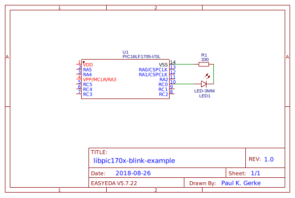
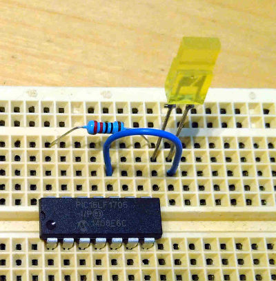
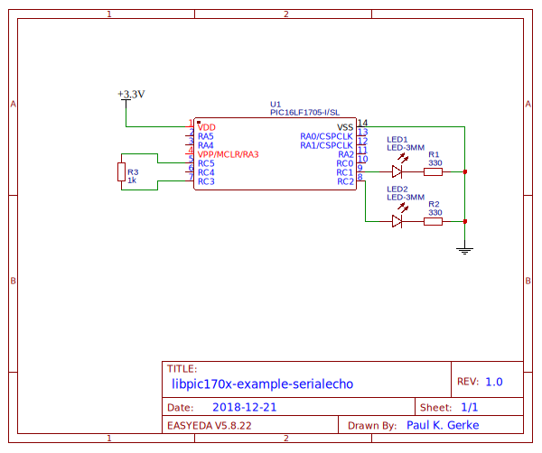
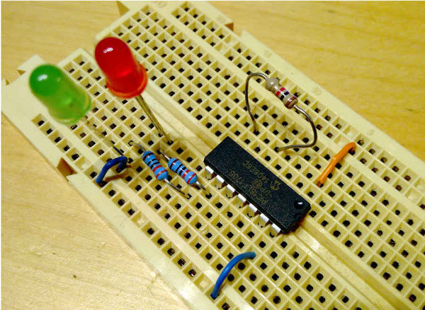

Examples               {#examples-page}
========

[TOC]

# Blink example

The blink-example illustrates the use of the [timer0](@ref timer0-guide) and [pinio](@ref pinio-guide) libraries. This example was designed for the PIC16LF1705, however the example should be easy to modify to also work for all other chips.

To try out the circuit, start by building up the demo circuit:

Schematic: [https://easyeda.com/trugata/libpic170x-examples-blink](https://easyeda.com/trugata/libpic170x-examples-blink)

After building up your circuit as shown, connect a PICkit to the PIC microcontroller.

## Software

Make sure to have the [MPLAB-X IDE](https://www.microchip.com/mplab/mplab-x-ide) and the [xc8 complier](https://www.microchip.com/mplab/compilers) installed on your machine and that your PICkit is ready for use. Then open the [blink-project files](@ref blink.X/main.c) that can be found in the directory `examples/blink.X/` with the MPLAB-X IDE.

By default, a PICkit 3 should be configured. If not configure your programming device and enable the "power the target circuit-option" in your IDE, or power your circuit with other means.

Now, everything should be ready to go. Press "Run Main Project" (provided that the blink-project is your only open project), and the demo should upload and run.

# Serial Echo

The serial echo example illustrates how to use the [serial](@ref serial-guide) library to send and receive data. The example is designed for the PIC16LF1705 and makes use of two LEDs that visualize sending and receiving of a single test byte.

To try out the example, built up the following circuit:

Schematic: [https://easyeda.com/trugata/libpic170x-examples-serialecho](https://easyeda.com/trugata/libpic170x-examples-serialecho)

Data is sent from pin RC5 and received on ping RC3. During initialization, the PIC will send a test byte (0xE2) via the output pin. The output pin is connected to the input pin via resistor R3. The reception EUSART will receive the sent character and emit an interrupt in the source code which write the received character into a buffer. When the character was received, the received character is compared to the reference test byte (0xE2). If they are equal, LED2 flashes once (picture color: green). Then the received byte is resent. During sending LED1 flashes once (picture color: red).

The result should alternating flashing of LED1 and LED2 as the test byte is sent and received over and over again. The communication speed is 9600 baud. Disconnecting R3 while the circuit is running will interrupt the send-receive cycle. To restart it the PIC needs to be reset.
