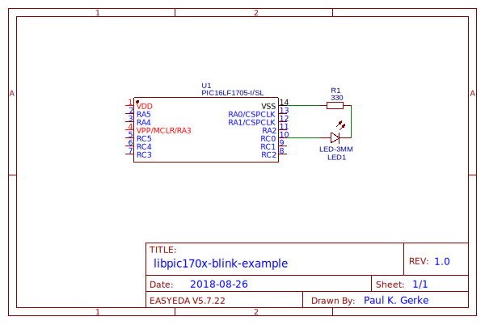

Examples               {#examples-page}
========

[TOC]

# Blink example

The blink-example illustrates the use of the [timer0](@ref timer0-guide) and [pinio](@ref pinio-guide) libraries. This example was designed for the PIC16LF1705, however the example should be easy to modify to also work for all other chips.

To try out the circuit, start by building up the demo circuit:

Schematic: [https://easyeda.com/trugata/libpic170x-examples-blink](https://easyeda.com/trugata/libpic170x-examples-blink)

After building up your circuit as shown, connect a PICkit to the PIC microcontroller.

## Software

Make sure to have the [MPLAB-X IDE](https://www.microchip.com/mplab/mplab-x-ide) and the [xc8 complier](https://www.microchip.com/mplab/compilers) installed on your machine and that your PICkit is ready for use. Then open the [blink-project files](@ref blink.X/main.c) that can be found in the directory `examples/blink.X/` with the MPLAB-X IDE.

By default, a PICkit 3 should be configured. If not configure your programming device and enable the "power the target circuit-option" in your IDE, or power your circuit with other means.

Now, everything should be ready to go. Press "Run Main Project" (provided that the blink-project is your only open project), and the demo should upload and run.